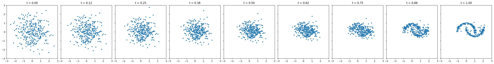
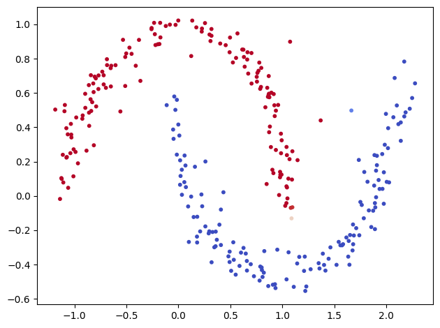
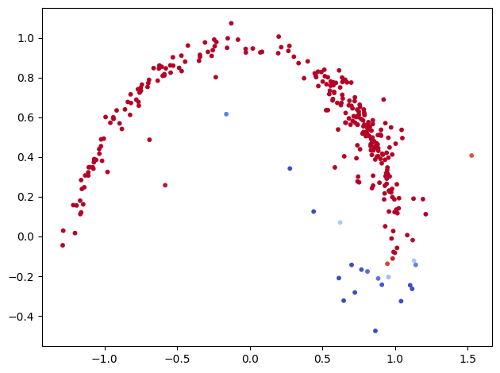
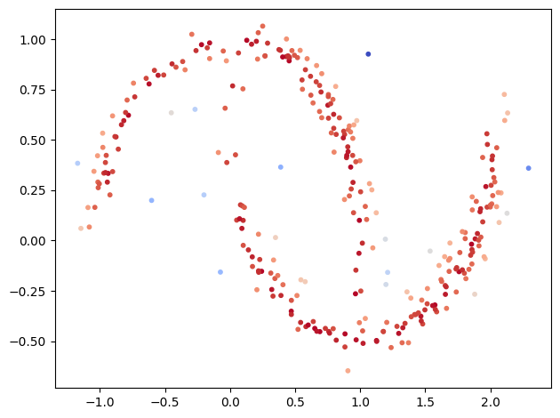
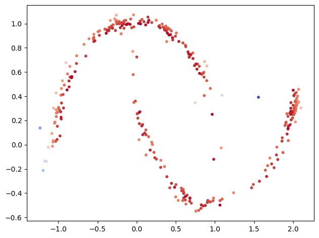

# RL Finetunning for Flow matching model
This repository contains the tutorial for finetunning flow matching model with reinforcement learning (PPO). 

The formulation is from [DDPO](https://github.com/jeongeun980906/RL-Finetunning-Flow-matching-model) paper. 

## 1. Train original flow matching model and classifer
[flow_matching.ipynb](flow_matching.ipynb)

  


### Acknowledgements

This file includes a portion of code derived from:

- Author(s): Facebook Research
- Copyright: Facebook Research
- License: CC BY-NC 4.0
- Source Code: https://github.com/facebookresearch/flow_matching/blob/main/examples/standalone_flow_matching.ipynb
- Modification Date: 2025-02-05
- Description: Code file is extracted.


## 2. Finetune your model with un-learning reward.
The code is in [rl_cls.ipynb](rl_cls.ipynb). 

In this code, we aim to un learn the down half of the moon. 

Reward function is a logit of the upper moon by trained classifier. 
<span style="color:blue">*Blue* </span> has lower reward while <span style="color:red">*red* </span> has higher reward. 


```
def get_reward(x):
    confidence = classifier(x)
    confidence = torch.sigmoid(confidence)[:,0]
    reward = 1-confidence
    return reward.cpu().detach().numpy()
```

### Finetunning Results




## 3. Finetune your model with fidelity reward.
The code is in [rl_fid.ipynb](rl_fid.ipynb).

In this code, we aim to sharpen the moon shape. 

<span style="color:blue">*Blue* </span> has lower reward while <span style="color:red">*red* </span> has higher reward. 


```
def get_reward(x):
    '''
    outer_circ_x = np.cos(np.linspace(0, np.pi, n_samples_out))
    outer_circ_y = np.sin(np.linspace(0, np.pi, n_samples_out))
    inner_circ_x = 1 - np.cos(np.linspace(0, np.pi, n_samples_in))
    inner_circ_y = 1 - np.sin(np.linspace(0, np.pi, n_samples_in)) - 0.5
    '''
    x_cor = x[:,0]
    y_cor = x[:,1]
    # print(x_cor, y_cor.shape)
    outer = (x_cor**2 + y_cor**2)
    outer_reward = 1-abs(outer.cpu().detach().numpy() - 1) 
    inner = ((x_cor-1)**2 + (y_cor-0.5)**2)
    inner_reward = 1-abs(inner.cpu().detach().numpy() - 1)
    reward = np.maximum(outer_reward, inner_reward) 
    return reward
```

### Finetunning Results


